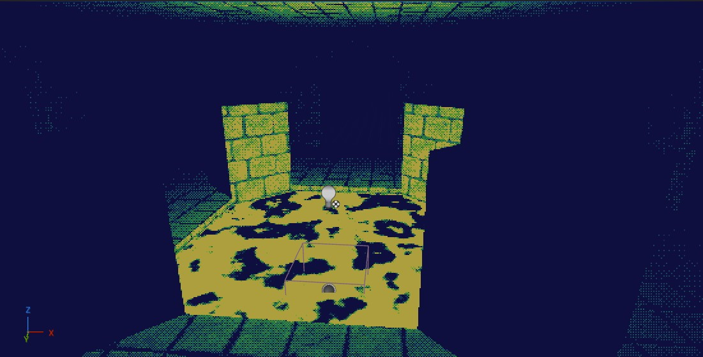

# UE5-Pixel-Perfect
A material post processing effect for Unreal Engine 5 for pixel-based games.

## How To Use

It's pretty simple to use, and most values are self-explanitory. "Dual Colour Toning", "HSV Blending" and "Fast Linear to sRGB" act as booleans, though we cannot use boolean values as shader properties, so they are shown as 0-1 floats.

Basically, to use it, open your Unreal Engine project in the file explorer (make sure Unreal Engine is closed). Under Content, create a "Graphics" folder (including capital G) and copy the UEPixelPerfect folder into this Graphics folder.

The reason for this specific layout is because Unreal Engine throws a bit of a hissy fit if you don't copy things and paste them with the *exact* same path, I tend to put all generic effects into a Graphics folder, and so you're forced to do it too.

To then actually see it, create a Post Process Volume, go down to Rendering Features, add a new Post Process Material and set the material to one of the examples, found in UEPixelPerfect/Examples. Alternatively, create your own material instance of M_PixelPerfect and change the settings yourself.

## About

Unreal Engine is primarily designed for developing realistic 3D games, and while its built-in post processing effects and tonemapper work well, they completely destroy any attempt at NPR (non-photorealistic) visuals. More specifically, the built-in (and force-enabled) ACES-based tonemapper tends to warp and shift colours, which works great in a photorealistic game, but not so much in a pixel-based game, just for example.

UE Pixel Perfect aims to solve this issue, and adds some artistic utilities, so that people can see your game in the way you intended.

At it's core, UEPP replaces the tonemapper with a simple Linear -> sRGB conversion, immediately restoring the original and artist-intended colours. But realistically, too many things are made separate these days (cough cough Maya, Photoshop, Substance Painter cough cough), and so the material includes plenty of other effects, as listed here:

- Linear -> sRGB conversion (duh)
- Image resolution scaling
- Colour quantization
- Dithering (with dither textures, 4x4 bayer matrix & blue noise included)
- Dual colour toning

### Image Resolution Scaling
It's as simple as it sounds: scale the resolution of the screen. Use a 0-1 value to control the scaling, with 0 being no resolution, 0.5 being 50% of the original resolution, and 1 (default) being the source resolution.

### Colour Quantization
Despite the scary big word, it basically means "reduce the number of colours on screen". Default is 1024, but realistically for any effect use 8, 16, 32, etc...

### Dithering
Dithering works right beside colour quantization to smooth out the harsh steps using a dither pattern, with a 4x4 bayer matrix & blue noise pattern included by default.

### Dual Colour Toning
Blend between two colours based on the image's luminance. You can optionally use HSV blending for a more colourful result, and it already works with colour quantization and dithering.

## General Advice

### 2D
For 2D pixel art, I would advice against using anything but the default MI_PixelPerfectBase, all that's really needed is the colour correction that comes with it by default. Lowering the resolution and decreasing the number of colours can ruin the pixel art, and generally you won't need to do any other colour effects.

### 3D
You can use any of the effects in 3D, play with it as you wish, but there are a few things I would advice for more retro games to do with Unreal Engine itself.
- Lumen isn't really needed, especially with pixel art.
- I would personally make your materials use the M_PixelPerfectSurface material as a base, as it removes all unnecessary lighting effects, that'll just get lost in the effects anyway.
- On your lights, set the Intensity Units to Unitless and use values like 1 or 4 or whatever, but also make sure to, under Advanced, disable Use Inverse Squared Falloff, as it will make your lights really hard to work with.
- On your PostProcessVolume, under Exposure, set Metering Mode to Manual, you won't need auto exposure with the different light setup.

There are a few other things as well, like ideally not having a Sky Light in the scene when using the included M_PixelPerfectSurface, as it has it's own ambient lighting option, but reallistically just do what you want.

## Updates

### v1.0
Initial project

### v1.1
Added:
- PixelPerfectSurface material base, specifically for 3D retro projects. Includes option for PSX-style texture distortion (Affine texture mapping).

Changed:
- "Boolean" floats act more as booleans, and don't require exactly 0 or 1 (threshold of 0.5).
- Linear sRGB "fast" conversion changed to use gamma 2.4, which I hear is correct (not sure though as there's no doccumentation).
- Luminance calculation for Dual Colour Toning changed to use linear values, which is the correct method.
- Dual Colour Toning brightness & contrast options.

Other:
- There's now a big Custom node where I tried to write it all out in HLSL, but I can't find any good doccumentation so it's just left there unused for now.
